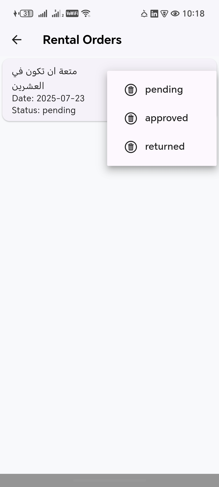

# 📚 Bookify

A simple book rental app built with Flutter 3.27.1 using Provider for state management. Bookify allows both users and admins to manage book rentals with a smooth UI, offline storage, and local login.

---

## 🚀 Features

### 👤 User Side
- 🔍 Explore available books
- 🔎 Search by title
- 📅 Book a book with a selected date
- 🌙 Dark mode support
- 📋 View your own rentals

### 🛠️ Admin Side
- ➕ Add new books
- ✏️ Update existing books
- 🗑️ Delete books
- 👥 View all user rentals
- ✅ Confirm or return rentals
- 🗑️ Delete user rentals

---

## 🔐 Login

### Mocked Accounts (stored locally with SQLite):
- **User**
  - **Username:** `user@gmail.com`
  - **Password:** `123`
- **Admin**
  - **Username:** `admin@gmail.com`
  - **Password:** `123`

> Login sessions are saved using local SQLite storage.

---

## 🧱 Tech Stack

- **Flutter:** `3.27.1`
- **State Management:** `Provider`

### 📦 Dependencies
- [`go_router`](https://pub.dev/packages/go_router) — Navigation & routing
- [`sqflite`](https://pub.dev/packages/sqflite) — Local database
- [`path`](https://pub.dev/packages/path) — File system paths
- [`path_provider`](https://pub.dev/packages/path_provider) — Platform file locations

---

## 🗃️ Local Storage

All data, including:
- Login session
- Books
- Rentals  
are persisted using **SQLite** via `sqflite`.

---

## 📸 Screenshots

<div align="center">

<table>
  <tr>
    <th>User Home</th>
    <th>User Drawer</th>
    <th>Dark Mood</th>
  </tr>
  <tr>
    <td></td>
    <td></td>
    <td></td>
  </tr>

  <tr>
    <th>Book Details</th>
    <th>Booking Configmation</th>
    <th>User Rentals</th>
  </tr>
  <tr>
    <td></td>
    <td></td>
    <td></td>
  </tr>

  <tr>
    <th>Admin Dashboard</th>
    <th>Admin Add New Book</th>
    <th>Admin View Rentals</th>
  </tr>
  <tr>
    <td></td>
    <td></td>
    <td></td>
  </tr>

  <tr>
    <th>Search</th>
    <th>Login Validation 1</th>
    <th>Login Validation 2</th>
  </tr>
  <tr>
    <td></td>
    <td></td>
    <td></td>
  </tr>

  <tr>
    <th>Change Rental Status</th>
    <th>Rental Approved</th>
    <th>User Rental After Approved</th>
  </tr>
  <tr>
    <td></td>
    <td></td>
    <td></td>
  </tr>
</table>

</div>
---

## 🛠️ Setup Instructions

1. Clone the repo:
   ```bash
   git clone https://github.com/your-username/bookify.git
   cd bookify

2. Install dependencies:
     flutter pub get
3. flutter run
   
